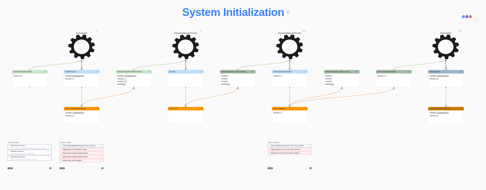

# System Initialization

A reusable event model that describes how a system bootstraps itself on first
start, and how it re-initializes when a new version of the initialization module
ships. It is generic — the actual tasks performed during initialization
(defining permissions, roles, granting permissions, seeding reference data,
etc.) are left to whichever module is being initialized.

## Concept

Initialization is modelled as a versioned, idempotent workflow driven by an
automation (`System Initializer`). Each version of the initialization module
declares a list of tasks. The system records progress through those tasks so
that an initialization run can be replayed safely: requesting the same version
twice is rejected, and finalizing a version that was never requested is
rejected.

A module's task list, by convention, ends with a finalization task that emits
`System Initialized` for that version, locking the version in.

## Slices

The flow reads left-to-right across the timeline.

### 1. First Start

The `System Initializer` automation runs on system startup. It reads the
`System Initialization Version` read model to discover the highest version that
has completed initialization so far (version `0` if the system has never been
initialized).

### 2. Request System Initialization

The automation issues an `Initialize System` command for the next version it
needs to bring online. The command emits `System Initialization Requested`
(`module`, `version`).

**Specifications** (`Initialize System`):

- Emits `SystemInitializationRequested` when nothing has run.
- Rejected when the requested version is out of sequence (e.g. asking for v3
  before v1).
- Rejected when the version has already been requested.
- Rejected when the version has already been initialized.
- Rejected when a version is skipped (e.g. v3 after v1 finalized).

### 3. Populate Initialization Tasks

The `System Initialization Tasks To Process` read model reacts to
`System Initialization Requested` by loading the module's declared tasks into
its `pending` list. Each task entry carries a command to execute and the
condition (typically a single event) that marks the task complete.

### 4. Process Task

The `System Initialization Task Processor` automation pulls the next pending
task, issues its command (`{Do Task}` — generic on the board because the actual
commands are module-specific), and waits for the corresponding `{Task Done}`
event.

### 5. Mark Task Done *(informational)*

The `Tasks To Process` read model removes the completed task from `pending` so
the processor advances to the next one on the next tick.

### 6. Finalize System Initialization

When `pending` is empty, the task processor issues `Finalize System
Initialization` (carrying the active version). The command emits
`System Initialized` for that version.

**Specifications** (`Finalize System Initialization`):

- Emits `System Initialized` after the version was requested and all tasks are
  done.
- Rejected when the version was never requested.
- Rejected when the version is already initialized.

### 7. Mark Initialization Done *(informational)*

The tasks read model observes `System Initialized` and clears its state for
that version.

### 8. Mark Initialized *(informational)*

The `System Initialization Version` read model advances to the version carried
by `System Initialized`, becoming the value the `System Initializer` reads on
the next startup.

**Specifications** (`System Initialization Version`):

- Before the system is first started, version is `0`.
- After `System Initialized v1`, version is `1`.
- After multiple `System Initialized` events, the version reflects the highest
  one that completed (e.g. `1`, `2`, `3` → version `3`).

### 9. Request System Initialization V2 *(informational)*

A worked example of a subsequent initialization run: on a later startup, the
`System Initializer` sees version `1` is the current version, and issues
`Initialize System` for `SystemInit.V2`, emitting `System Initialization
Requested` for version `2`. The same Process Task / Finalize loop then runs for
the V2 task list.

## Key Information

- **Context**: `INTERNAL` across all elements — this is a platform-level
  concern, not a domain workflow.
- **Idempotency** is enforced at both ends: requesting an already-requested or
  already-initialized version is rejected, and finalizing an unrequested or
  already-finalized version is rejected.
- **Sequencing**: versions must be requested in order, with no gaps.
- **Reusability**: `{Do Task}` and `{Task Done}` are intentionally generic
  placeholders — concrete modules plug their own commands and events into the
  task list (permissions, roles, role grants, etc.).
